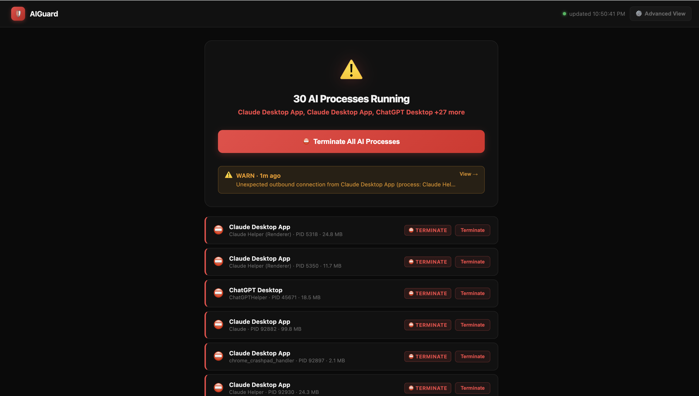
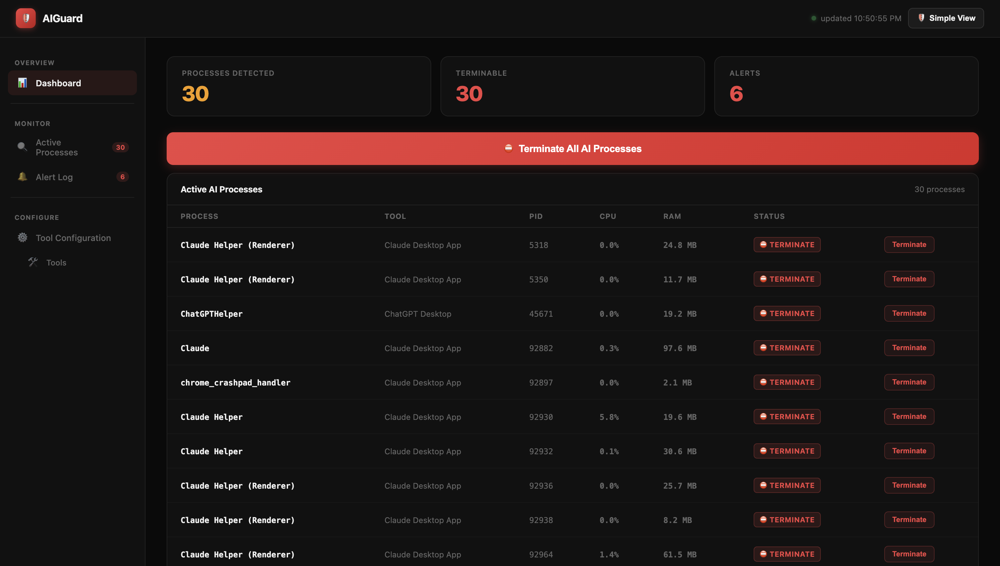
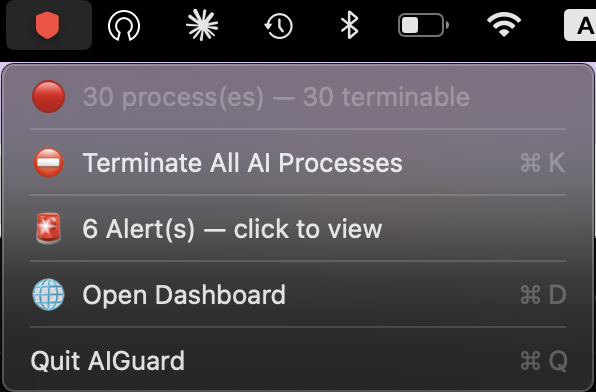

# AIGuard

**AIGuard** is an AI process kill-switch — a lightweight background daemon that monitors your machine for running AI tools (Claude Code, Cursor, Aider, Ollama, etc.) and lets you terminate them instantly from the command line or a macOS menu bar app.

## Table of Contents

- [Features](#features)
- [Dashboard](#dashboard)
- [macOS Installation](#macos-installation)
- [Linux Installation](#linux-installation)
- [VPS / Cloud Server](#vps--cloud-server)
- [Deployment Scripts](#deployment-scripts)
- [CLI Reference](#cli-reference)
- [REST API](#rest-api)
- [Configuration](#configuration)
- [Known AI Tools](#known-ai-tools)
- [Project Structure](#project-structure)
- [Roadmap](#roadmap)
- [Building from Source](#building-from-source)
- [License](#license)
- [Disclaimer](#️-disclaimer)


---

## Features

- Detects 50+ known AI tools: agents, infra, desktop apps, and in-editor AI
- Immediately terminates processes (and their entire process group) with one command
- Suspicious activity alerts: mass file deletions, writes to protected dirs, credential file access, CPU spikes, excessive forking, unexpected network connections
- macOS menu bar tray app with live status indicator (green/yellow/red)
- Configurable per-tool terminate/monitor setting, persisted to `~/.aiguard/config.json`
- Web dashboard at `http://localhost:7474`
- Linux-compatible CLI (daemon + all commands, no tray app required)

---

## Dashboard

AIGuard includes a web dashboard at `http://localhost:7474` with two views you can toggle between.

**Simple view** — card-based overview with a one-click terminate button and the latest alert:



**Advanced view** — full process table with CPU, RAM, PID, per-process terminate controls, alert log, and tool configuration sidebar:



---

## Menu Bar App (macOS)

AIGuard includes a lightweight menu bar app that shows the live status of your system with a color-coded indicator — green when clear, yellow when monitoring, and red when terminable processes are detected.



---

## macOS Installation

### Requirements

- macOS 12 or later
- **Go 1.22+** — `brew install go`
- **Xcode Command Line Tools** — `xcode-select --install`

Both are required to build the daemon and menu bar app.

### 1. Clone the repo

```bash
git clone https://github.com/saasscaleup/ai-guard.git
cd ai-guard
```

### 2. Build and install

```bash
./deploy-macos.sh
```

This script:
1. Compiles the daemon (Go) and menu bar app (Swift)
2. Packages them into `/Applications/AIGuard.app`
3. Restarts the daemon and menu bar app
4. Verifies both are running

For more details, see [SCRIPTS.md](SCRIPTS.md).

### 3. Verify

- A coloured dot appears in your macOS menu bar (🟢 = clear, 🟡 = monitoring, 🔴 = terminable processes detected)
- Open [http://localhost:7474](http://localhost:7474) to see the live dashboard

### About macOS Code Signing

AIGuard is currently in **alpha/testing phase** and is built without an Apple Developer certificate. On first launch, you may see:

> "AIGuard" cannot be opened because it is from an unidentified developer.

This is expected and safe—you built the app yourself on your machine. To approve it:

**Option 1 (automatic):** The deployment script removes restrictions that allow the app to launch without warnings.

**Option 2 (manual):** Right-click the app and click "Open", or approve it in **System Settings → Privacy & Security**.

**Future:** Once AIGuard is ready for public release, we plan to obtain an Apple Developer account and code-sign the app with a certificate, which will eliminate this warning entirely. For now, during testing, local approval is sufficient.

### Start / stop (macOS)

```bash
./aiguard-ctl.sh start     # start daemon + tray app
./aiguard-ctl.sh stop      # stop both
./aiguard-ctl.sh restart   # restart both
./aiguard-ctl.sh status    # show running state
./aiguard-ctl.sh logs      # tail the daemon log (/tmp/aiguard-daemon.log)
```

### Dashboard access (macOS)

The dashboard is available at `http://localhost:7474` as soon as the daemon is running. The API binds to `127.0.0.1` only — it is not reachable from other machines.

### Auto-start on login

Open **System Settings → General → Login Items** and add `/Applications/AIGuard.app`.

---

## Linux Installation

### Requirements

- Linux (Ubuntu 20.04+, Debian 11+, or any modern distro)
- Go 1.22+

```bash
# Ubuntu / Debian
sudo apt install golang-go

# Fedora / RHEL
sudo dnf install golang
```

Optional — desktop notifications (headless servers can skip this):

```bash
sudo apt install libnotify-bin   # Ubuntu / Debian
sudo dnf install libnotify       # Fedora
```

### 1. Clone the repo

```bash
git clone https://github.com/saasscaleup/ai-guard.git
cd ai-guard
```

### 2. Build and install

**System-wide** (requires sudo):

```bash
./install-linux.sh
```

Installs `aiguard` to `/usr/local/bin`.

**Local install** (no sudo):

```bash
./install-linux.sh --local
```

Installs to `~/.local/bin/aiguard`. Add to PATH if not already there:

```bash
echo 'export PATH="$HOME/.local/bin:$PATH"' >> ~/.bashrc && source ~/.bashrc
```

### 3. Start the daemon

```bash
aiguard daemon
```

### 4. Run as a systemd service (recommended)

```bash
mkdir -p ~/.config/systemd/user

cat > ~/.config/systemd/user/aiguard.service << 'EOF'
[Unit]
Description=AIGuard — AI process monitor
After=network.target

[Service]
ExecStart=/usr/local/bin/aiguard daemon
Restart=on-failure
RestartSec=5

[Install]
WantedBy=default.target
EOF

systemctl --user daemon-reload
systemctl --user enable --now aiguard
systemctl --user status aiguard
```

### 5. Verify

```bash
aiguard status
curl -s localhost:7474/status | python3 -m json.tool
```

---

## VPS / Cloud Server

AIGuard works on any Linux VPS or cloud instance (AWS EC2, DigitalOcean, Hetzner, etc.).

### Quick deployment

After cloning the repo, deploy with a single command:

```bash
./deploy-vps.sh           # System-wide install (requires sudo)
./deploy-vps.sh --local   # Local install (no sudo)
```

This script automatically:
1. Pulls the latest code from `origin/master`
2. Builds the binary
3. Installs to system or local directory
4. Restarts the daemon
5. Verifies the daemon is running

For updates, just run `./deploy-vps.sh` again.

### Manual installation

If you prefer not to use the script, follow the [Linux Installation](#linux-installation) steps above.

### Dashboard access via SSH tunnel

The REST API binds to `127.0.0.1:7474` only — it is never exposed on a public interface. To access the dashboard from your local browser, forward the port over SSH:

```bash
ssh -L 7474:127.0.0.1:7474 user@your-server-ip
```

Then open `http://localhost:7474` in your browser. Traffic is encrypted via SSH and the port is never opened publicly.

To make the tunnel automatic, add this to `~/.ssh/config` on your local machine:

```
Host myserver
  HostName your-server-ip
  User youruser
  LocalForward 7474 127.0.0.1:7474
```

Now `ssh myserver` sets up the tunnel on every connection.

### Firewall

Do **not** open port 7474 in your firewall or cloud security group. The API has no authentication — exposing it publicly would allow anyone to trigger a termination.

### Recommended alert rule adjustments for servers

Some rules that are useful on a developer workstation generate noise on a server:

```bash
# Silence noisy network alert (servers make many outbound connections)
aiguard rules disable network.outbound

# Re-enable if you want to monitor unexpected connections
aiguard rules enable network.outbound
```

All other rules (`fs.mass-delete`, `fs.sensitive-file`, `fs.ssh-key`, etc.) are worth keeping enabled on a server.

### Run as a system service (headless, survives logout)

If you need the daemon to run even when no user is logged in, use a system-level service instead of a user service:

```bash
sudo tee /etc/systemd/system/aiguard.service > /dev/null << 'EOF'
[Unit]
Description=AIGuard — AI process monitor
After=network.target

[Service]
ExecStart=/usr/local/bin/aiguard daemon
Restart=on-failure
RestartSec=5
User=YOUR_USERNAME

[Install]
WantedBy=multi-user.target
EOF

sudo systemctl daemon-reload
sudo systemctl enable --now aiguard
sudo systemctl status aiguard
```

Replace `YOUR_USERNAME` with the user whose AI processes you want to monitor.

---

## Deployment Scripts

AIGuard includes several deployment scripts for different scenarios. Each script automates a different workflow.

**For detailed information about all scripts, see [SCRIPTS.md](SCRIPTS.md).**

### Quick reference

| Script | Use case | Platform |
|--------|----------|----------|
| `deploy-macos.sh` | Full build + install + restart (macOS) | macOS |
| `install-macos.sh` | Install pre-built binaries (macOS) | macOS |
| `aiguard-ctl.sh` | Start/stop/restart daemon (macOS) | macOS |
| `install-linux.sh` | Build + install (Linux) | Linux |
| `deploy-vps.sh` | Git pull + build + install + restart (VPS) | Linux |

**macOS:**
```bash
./deploy-macos.sh              # First-time setup or rebuild
./aiguard-ctl.sh start|stop    # Day-to-day control
```

**Linux:**
```bash
sudo ./install-linux.sh        # System-wide install
./install-linux.sh --local     # Local install (no sudo)
```

**VPS:**
```bash
./deploy-vps.sh                # Deploy or update
./deploy-vps.sh --local        # Deploy locally (no sudo)
```

---

## CLI Reference

All commands work on both macOS and Linux.

```
aiguard daemon                    Start the background daemon + REST API
aiguard status                    List detected AI processes
aiguard status --full             List with full command-line paths
aiguard kill                      Terminate ALL processes marked Terminate
aiguard kill --pid <PID>          Terminate one specific process by PID
aiguard list                      Show all known tools and their terminate/monitor setting
aiguard enable  "<tool name>"     Mark a tool for termination
aiguard enable  all               Mark ALL tools for termination
aiguard disable "<tool name>"     Exclude a tool from termination
aiguard disable all               Set ALL tools to monitor only
aiguard alerts                    Show recent suspicious activity alerts
aiguard rules                     List all detection rules and their on/off state
aiguard rules enable  <rule-id>   Activate a detection rule
aiguard rules enable  all         Activate ALL detection rules
aiguard rules disable <rule-id>   Silence a detection rule
aiguard rules disable all         Silence ALL detection rules
```

### Examples

```bash
aiguard kill                            # terminate everything right now
aiguard disable "Ollama"                # stop terminating Ollama, just monitor it
aiguard enable  "Claude Code CLI"       # re-enable termination for Claude Code
aiguard rules disable network.outbound  # silence noisy network alerts
aiguard status --full                   # see full command lines
```

---

## REST API

The daemon exposes a local REST API at `http://127.0.0.1:7474`:

| Method | Path            | Description                          |
|--------|-----------------|--------------------------------------|
| GET    | `/`             | Web dashboard                        |
| GET    | `/status`       | Detected AI processes (JSON)         |
| POST   | `/kill`         | Terminate all marked-Terminate processes       |
| POST   | `/kill/pid`     | Terminate one process by PID              |
| GET    | `/alerts`       | Suspicious activity alerts           |
| POST   | `/alerts/clear` | Clear the alert log                  |
| GET    | `/tools`        | All tools with terminate/monitor state |
| POST   | `/tools/set`    | Toggle termination flag for one tool |

`/tools/set` body:

```json
{ "name": "Claude Code CLI", "kill": false }
```

---

## Configuration

Config lives at `~/.aiguard/config.json`. It is created automatically on first run and re-synced from built-in defaults on every daemon start. Only your per-tool termination preferences are preserved across upgrades.

### Detection rules

| Rule ID              | What it detects                                              |
|----------------------|--------------------------------------------------------------|
| `fs.protected-write` | Write to `/etc`, `/usr`, `/bin`, `/System`, etc.             |
| `fs.mass-delete`     | 10+ file deletions within 5 seconds                          |
| `fs.sensitive-file`  | Write to `.env`, `.aws`, `.ssh`, `*.pem`, `*.key`, etc.      |
| `fs.ssh-key`         | New SSH key created in `~/.ssh/`                             |
| `fs.cron-launchd`    | Cron job or launchd agent added/modified                     |
| `process.cpu-spike`  | AI process CPU above 85%                                     |
| `process.fork`       | AI process spawning 40+ child processes                      |
| `network.outbound`   | Unexpected outbound connection from a high-risk AI process   |

---

## Known AI Tools

AIGuard monitors and optionally terminates these tools. Use `aiguard list` to see the full list with current settings.

**Agents (terminate by default):** Claude Code CLI, OpenAI Codex CLI, Aider, AutoGPT, Cursor IDE, Windsurf, Cline, Roo Code, Goose, OpenHands, Devin, Plandex, Amazon Q Developer, Sourcegraph Amp, Gemini CLI, Kiro, Kilo Code, OpenClaw, OpenCode, Hermes Agent, ZeroClaw, Open Interpreter, SWE-agent, MetaGPT, AutoGen, CrewAI, LangGraph, GPT Pilot, GPT-Engineer, Mentat, BabyAGI, SuperAGI, Smol Developer

**AI Infrastructure (terminate by default):** Ollama, MCP Servers (Node), OpenAI API Processes, llama.cpp Server, Text Gen WebUI, koboldcpp, LocalAI

**AI Infrastructure (monitor only):** LM Studio, Flowise, Open WebUI

**Desktop Apps (monitor only):** Claude Desktop, ChatGPT Desktop, Warp Terminal, Jan, AnythingLLM, GPT4All, Msty

**In-Editor AI (monitor only):** GitHub Copilot, VS Code Extension Host, Codeium, Continue.dev, Cody, Tabby, JetBrains AI, Zed, Neovim AI plugins, Tabnine, Supermaven

---

## Project Structure

```
aiguard/
├── cmd/
│   ├── aiguard/
│   │   └── main.go              # CLI entrypoint + daemon runner
│   └── aiguard-tray/
│       ├── MenuBar.swift        # macOS menu bar app (Swift/AppKit)
│       └── main.go              # Go systray fallback (not used in production)
├── internal/
│   ├── alerts/alerts.go         # Thread-safe in-memory alert store
│   ├── api/
│   │   ├── api.go               # REST API server
│   │   └── dashboard.html       # Embedded web dashboard
│   ├── config/config.go         # Tool list, terminate settings, alert rules
│   ├── suspicious/suspicious.go # FS + process + network monitors
│   └── watcher/watcher.go       # Process detection + terminate logic
├── deploy.sh                    # macOS build + install script
├── install-linux.sh             # Linux build + install script
├── aiguard-ctl.sh               # Start/stop/restart/status/logs helper
├── go.mod
└── go.sum
```

---

## Roadmap

### ✅ Phase 1 — macOS + Linux (current)
- [x] Go daemon with REST API (`localhost:7474`)
- [x] Process detection for 58+ AI tools
- [x] Terminate entire process groups with one command
- [x] Suspicious activity alerts (filesystem, process, network)
- [x] macOS menu bar app (Swift/AppKit) with live status indicator
- [x] Web dashboard — Simple and Advanced views
- [x] Linux CLI support with systemd service
- [x] Per-tool terminate/monitor configuration, persisted to disk

---

### 🔄 Phase 2 — Cloud Relay + Remote Termination Switch *(next)*
> Terminate AI processes from anywhere — not just from the same machine.

- [ ] Lightweight cloud relay server (WebSocket) — daemon connects outbound, no firewall changes needed
- [ ] Authenticated remote termination: trigger `terminate all` from any browser or phone
- [ ] Cloud web app — same dashboard experience hosted at a URL you own
- [ ] Real-time push: process list and alerts stream live to the web app
- [ ] Multi-machine support — manage several machines from one dashboard
- [ ] Self-hostable relay (Docker image) for privacy-conscious deployments

---

### 📱 Phase 3 — Mobile App *(iOS + Android)*
> One tap to terminate all AI processes from your phone, wherever you are.

- [ ] iOS app (Swift/SwiftUI) — live process list, terminate button, alert notifications
- [ ] Android app (Kotlin) — same feature set
- [ ] Push notifications for CRITICAL alerts (mass delete, unexpected network connection)
- [ ] Biometric authentication before termination actions
- [ ] Multiple machine profiles — switch between dev box, work laptop, server

---

### 🪟 Phase 4 — Windows Support *(last)*
> Full parity with macOS and Linux on Windows.

- [ ] Windows Service (`sc.exe` / NSSM) replacing the Unix daemon
- [ ] Windows system tray app (Go + `systray` or WinForms)
- [ ] PowerShell installer (`install-windows.ps1`)
- [ ] OS-aware process exclusions for Windows system paths (`C:\Windows\System32`, etc.)
- [ ] Windows-native notifications (toast notifications via `go-toast`)
- [ ] Task Scheduler support for auto-start on login

---

## Building from Source

```bash
# Daemon only (macOS + Linux)
go build -o aiguard ./cmd/aiguard/

# macOS tray app (requires Xcode CLT)
swiftc -o aiguard-tray cmd/aiguard-tray/MenuBar.swift
```

---

## License

This repository's source code is available under the [AGPL-3.0 license](LICENSE).

If your organization cannot comply with AGPL-3.0, a commercial license is available. Contact saasscaleup@gmail.com for details.

---

## ⚠️ Disclaimer

AIGuard is provided **"as-is"** without any warranty, express or implied. While designed to help monitor and control AI processes, it is **not** a substitute for:
- Professional security solutions
- System administration best practices  
- Proper authorization and access controls

For the complete legal terms, see the [LICENSE](LICENSE) file (AGPL-3.0).
